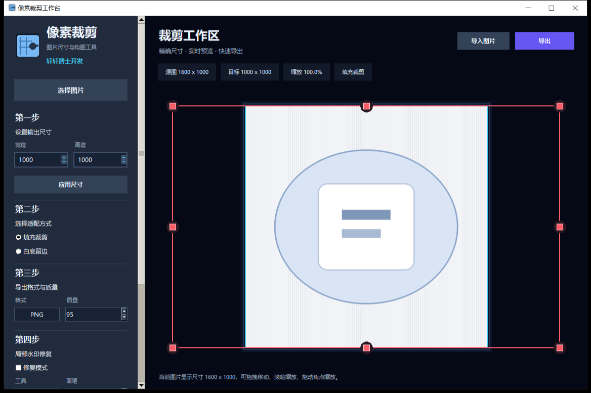

<h1 align="center">像素裁剪工作台</h1>
<p align="center"><b>Image Pixel Cropper</b></p>
<p align="center">Windows 10/11 · Python + Tkinter · Pillow / OpenCV</p>

> 按精确像素尺寸裁剪、构图和导出图片的本地小工具，支持拖拽导入、居中缩放、白底补边和局部水印修复。
>
> A local tool for cropping, framing and exporting images at an exact pixel size, with drag-and-drop import, centre scaling, white padding and local watermark repair.

> 关键词：图片裁剪、精确尺寸、水印修复、商品图、白底图 / Keywords: image crop, resize, exact pixel size, watermark removal, product image, white background, Tkinter

[简体中文](#界面预览) | [English](#english)

## 界面预览



## 功能

- **导入**：点击「选择图片」，或直接把图片拖进窗口，支持常见图片格式
- **精确尺寸**：填写目标宽高后点「应用尺寸」，按精确像素输出，实时预览
- **适配方式**：「填充裁剪」去掉多余边缘，「白底留边」让小图居中放在白底上
- **画面调整**：鼠标滚轮缩放、按住中键拖动、拖动橙色角点、居中图片、恢复原图尺寸
- **导出**：PNG / JPG / WebP / BMP / GIF / TIFF，JPG 可设置质量
- **局部水印修复**：进入修复模式后用画笔涂抹或框选，点「应用修复」自动填补（基于 OpenCV 图像修复算法）

适合给商品图、头像、封面图统一成同一个尺寸。

## 运行

先安装依赖：

```bat
python -m pip install -r requirements-image-cropper.txt
```

再双击 `run_image_cropper.bat`，或：

```bat
python image_cropper.py
```

## 项目结构

```
image_cropper.py                    主程序（界面与裁剪逻辑）
watermark_remover.py                局部水印修复（OpenCV inpaint）
像素裁剪工作台.spec                  PyInstaller 打包配置
requirements-image-cropper.txt      依赖清单
run_image_cropper.bat               启动脚本
assets/                             图标资源
```

## 说明

- 所有处理都在本地完成，不联网、不上传图片
- 水印修复需要 `opencv-python`，其余功能只需要 `Pillow`
- 拖拽导入需要 `tkinterdnd2`，缺失时仍可通过「选择图片」导入

---

## English

**Image Pixel Cropper** is a small Windows tool for producing images at an exact pixel size — useful for product photos, avatars and covers that must match a fixed dimension.

### Features

- Load images by button or drag-and-drop
- Enter an exact target width and height; live preview while you compose
- Fill crop (trim the edges) or white padding (centre a small image on a white canvas)
- Mouse wheel zoom, middle-button drag, orange corner handles, centre and reset commands
- Export as PNG, JPG, WebP, BMP, GIF or TIFF, with a JPG quality setting
- Local watermark repair: brush or box over an area and apply an OpenCV inpainting pass

### Run

```bat
python -m pip install -r requirements-image-cropper.txt
run_image_cropper.bat
```

### Notes

Everything runs locally; nothing is uploaded. `Pillow` is required, `opencv-python` is only needed for watermark repair and `tkinterdnd2` only for drag-and-drop.
